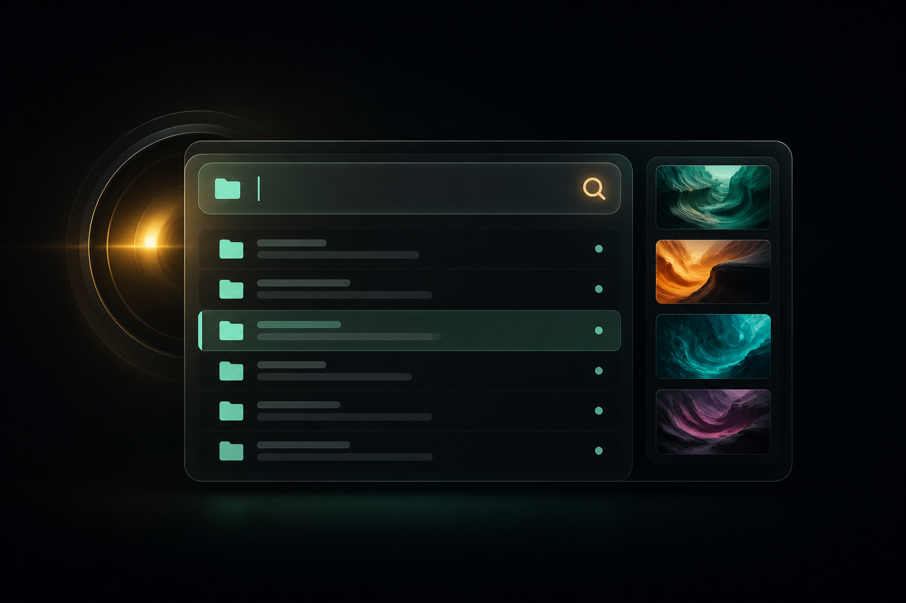

<div align="center">
  
  <h1>FolderLens</h1>
  <p><strong>Buscá la carpeta, no el archivo.</strong></p>
  <p>Un buscador visual, rápido y discreto para Windows: escribís una palabra, ves carpetas y descubrís su contenido con una tira de fotos al pasar el mouse.</p>
  <p>
    
    
    
  </p>
</div>

## La idea

FolderLens está pensado para esas bibliotecas llenas de carpetas con nombres parecidos: referencias, proyectos, recursos, fotos o material de trabajo. En vez de abrir una carpeta tras otra, presionás `Alt + Espacio`, escribís y reconocés el contenido de un vistazo.

> El hero de arriba es una imagen conceptual de presentación. La aplicación real es una ventana WPF nativa y liviana.

## Qué hace

- **Paleta flotante:** `Alt + Espacio` abre solo el buscador, listo para escribir.
- **Búsqueda acotada:** revisa únicamente las carpetas elegidas en Configuración.
- **Vista previa visual:** al pasar por un resultado, carga hasta cinco fotos de esa carpeta.
- **Apertura directa:** un clic sobre el resultado abre la carpeta en el Explorador.
- **Cero interrupciones:** `Esc` o un clic fuera ocultan la paleta.
- **Bajo consumo:** índice en memoria, caché local y miniaturas bajo demanda.
- **Siempre disponible:** se ejecuta desde la bandeja del sistema y puede iniciar con Windows.

## Primeros pasos

1. Instalá el runtime **.NET 8 Desktop** para Windows.
2. Cloná el repositorio y entrá en la carpeta:

   ```powershell
   git clone https://github.com/<tu-usuario>/folderlens.git
   cd folderlens
   ```

3. Ejecutá la aplicación:

   ```powershell
   dotnet run
   ```

4. Abrí **Configuración**, agregá tus carpetas raíz y presioná `Alt + Espacio`.

## Publicar un ejecutable

```powershell
dotnet publish FolderLens.csproj --configuration Release --runtime win-x64 --self-contained false --property:PublishSingleFile=true --output publish
```

El ejecutable publicado requiere el runtime de escritorio .NET 8. Para una versión autónoma, cambiá `--self-contained false` por `--self-contained true`; ocupará más espacio en disco.

## Diseño técnico

| Parte | Decisión |
| --- | --- |
| UI | WPF nativo, sin frameworks externos |
| Índice | Escaneo en segundo plano de las raíces configuradas |
| Caché | `%APPDATA%\\FolderLens` |
| Fotos | JPG, JPEG, PNG, WEBP, BMP, GIF, TIF y TIFF |
| Atajo | Hook global de teclado para `Alt + Espacio` |

## Estructura

```text
MainWindow.xaml(.cs)       Paleta, bandeja, atajo y resultados
SettingsWindow.xaml(.cs)   Configuración de carpetas
FolderIndexService.cs      Índice y miniaturas perezosas
IndexCacheStore.cs         Caché local del índice
SettingsStore.cs           Preferencias de la aplicación
FolderLens.ico             Ícono del ejecutable y la bandeja
assets/folderlens-hero.png Imagen conceptual del README
```

## Estado

FolderLens es una primera versión funcional. El índice se actualiza al iniciar o al pulsar **Actualizar** para mantener el consumo bajo; no escanea continuamente todo el disco.
